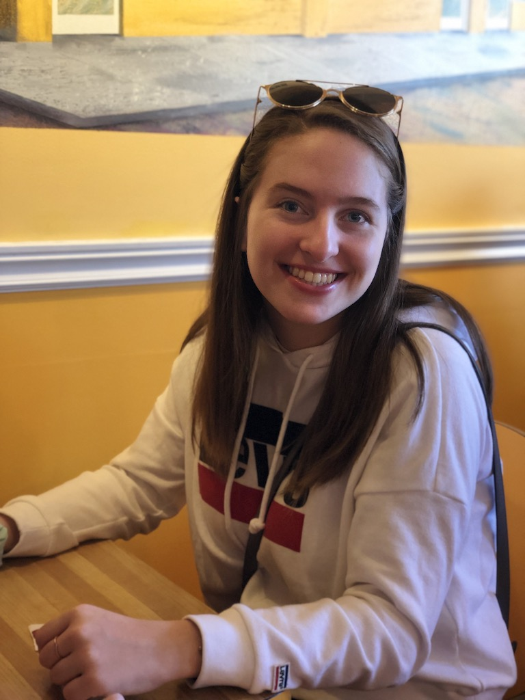

## Welcome to my Portfolio!

My name is Jocelyn, and I'm a 4th year Neuroscience major at Dalhousie. I've acquired some skills in python and data science that I will be showcasing here.

Any Questions? Please email me at [jc208691@dal.ca](mailto:jc208691@dal.ca)

## Reading in Data
Below is how I read in raw data from an experimental study to clean up and use for data analysis.
First using the glob function I created a list called "files" containing each file starting with 'spid' and ending with 'data.txt'.

  `files = glob ('spid*/*_data.txt')`

This is how I would create a list where each index of the list was an individual dataframe for each subject in the study, using the list comphrension technique.

  `dataframes = [pd.read_csv(x, sep='\t') for x in files]`

## Cleaning multiple DataFrames using a For Loop
Here is an example of code using a for loop to [iterate our cleaning code over a list of dataframes](Portfolio_Cleaning_Loop.md).

## Slicing Columns in a DataFrame
Here is an example of some code I wrote demonstrating how to read in a CSV file, create a DataFrame, and [slice the dataframe for certain columns using the groupby function](Portfolio_groupby.md).

## Data Visualization
Here is an example of [some code I wrote to generate a histogram using matplotlib.pyplot](PortfolioHistogram.htm).

Here is an example of [some code I wrote to create a boxplot using seaborn](DisneyBoxplot.htm).

## Working with EEG Data
Here is an example of code I wrote to [create a heat map of neural EEG data](PortfolioHeatMaps.htm).

## Working with MRI Data
Here is an example of code I wrote to [apply a mask to an MRI brain image using imageio, matplotlib.pyplot, and numpy](ApplyMask2.htm).
